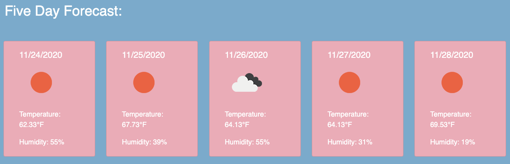

# weatherDashboard

The Open Weather Map API was used to create this Weather Dashboard.

[]

1. First I created a HTML skeleton with an input area and a search button.

[]

[]

2. Next I created an on click event and a function to search the name of a city and create an ajax call to retrieve the data of the city

[]

[]

3. I used the data that I retrieved to create the weather dashboard dynamically using jQuery

[]

[]

[]

4. Used local storage to store and retrieve searched cities and print into a list

[]

[]

[]

5. Used another ajax call to create the UV index, along with an if else statement to display appropriate color to show whether the uv index is severe or favorable

[]

    * Favorable - [] 
    * Moderate - []
    * High - []

6. Last and final ajax call to create the five day forecast dynamically

[]

[]

